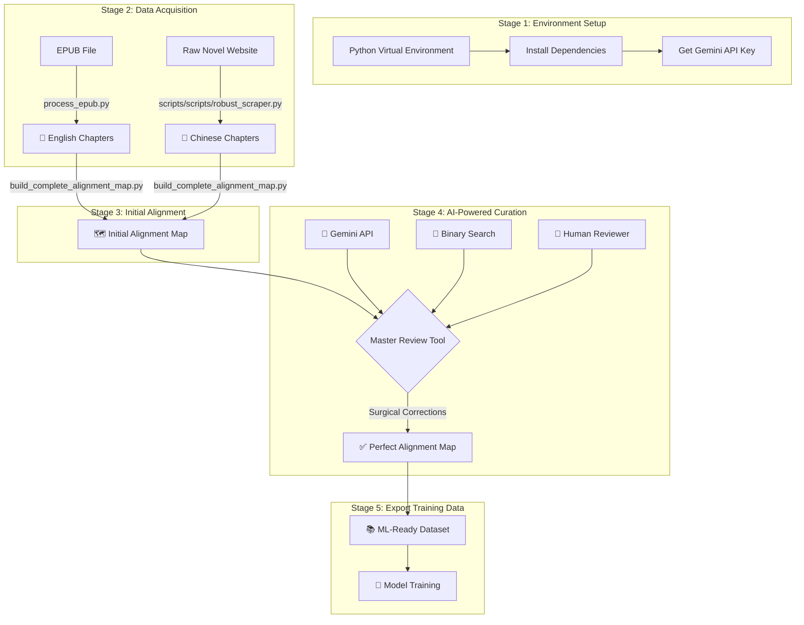
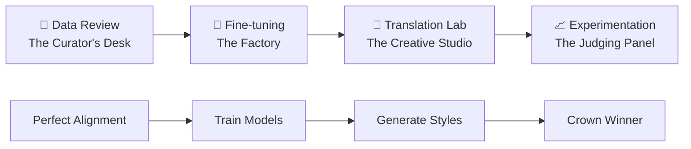

# 📚 Web Novel Translation Framework

A comprehensive framework to scrape, align, and prepare parallel text datasets from web novels for fine-tuning machine translation models. This project provides a full suite of tools, from a resilient, metadata-driven scraper to a sophisticated UI with **binary search alignment detection** and **surgical correction capabilities**.

## 🎯 What This Framework Does

- **Scrapes** Chinese web novels with resilient, resumable scraping
- **Processes** English EPUB translations into individual chapters  
- **Aligns** Chinese-English chapter pairs using AI-powered semantic similarity
- **Detects** misalignments with binary search (10x faster than linear search)
- **Corrects** alignment issues with surgical precision (preserve good alignments)
- **Exports** clean, aligned datasets ready for ML model training

## 📊 Core Workflow

The project follows a clear, sequential pipeline designed to produce high-quality aligned datasets:



## 🎯 Project Motivation & Philosophy

### **The Translation Quality Problem**
Traditional machine translation produces generic, one-size-fits-all outputs. But translation is inherently **pluralistic** - the same source text can be translated differently for different audiences, purposes, and styles:

- **Literal translations** preserve cultural nuances for academic readers
- **Dynamic translations** adapt content for Western entertainment consumers  
- **Simplified translations** make content accessible to young adult audiences

### **Our Solution: Pluralistic Translation Research Platform**
This framework enables systematic exploration of translation approaches by combining:

1. **High-Quality Training Data**: Perfect Chinese-English aligned parallel corpus
2. **Multiple AI Platforms**: Both Google Gemini and OpenAI fine-tuning capabilities
3. **Style Experimentation**: Test different prompts, models, and context strategies
4. **Quantitative Evaluation**: BERT similarity, BLEU scores, and statistical analysis
5. **Data-Driven Optimization**: Style leaderboards to identify best approaches

### **Core Innovation: Style-Centric Approach**
Instead of just comparing models, we compare **translation styles** where:
```
Style = Model + Prompt + History Context + Hyperparameters
```

This enables researchers to discover that a base model with excellent prompting might outperform a fine-tuned model with poor context strategy.

## 🏗️ Application Architecture

### **Four-Page Workflow: Military Precision Separation of Concerns**

The application follows a crystal-clear linear workflow where each page has **one focused purpose**:



#### **📖 Page 1: Data Review & Alignment (The Curator's Desk)**
**Purpose**: Create pristine, perfectly aligned parallel corpus
- **Input**: Raw scraped chapters + EPUB English chapters
- **Tools**: Binary search misalignment detection, surgical corrections, chapter splitting
- **Output**: Perfect `alignment_map.json`
- **Philosophy**: "Garbage in, garbage out" - perfect data is the foundation

#### **🤖 Page 2: Fine-tuning Workbench (The Factory)**  
**Purpose**: Train specialized models for translation
- **Input**: Perfect alignment map + hyperparameter configs
- **Tools**: JSONL export, dual-platform training (Gemini/OpenAI), job monitoring
- **Output**: Fine-tuned models ready for deployment
- **Philosophy**: Pure model training workflow - no dataset analysis clutter

#### **🧪 Page 3: Pluralistic Translation Lab (The Creative Studio)**
**Purpose**: Generate multiple translation styles for comparison
- **Input**: Raw chapters + model/prompt/history configurations  
- **Tools**: Dynamic model selection, prompt templates, smart history fallbacks, EPUB creation
- **Output**: Named translation bundles (e.g., `Literary_FineTuned_5shot/`)
- **Philosophy**: Creative experimentation space for style development

#### **📈 Page 4: Experimentation Analysis (The Judging Panel)**
**Purpose**: Evaluate and rank translation styles scientifically
- **Input**: Multiple translation bundles + official reference translations
- **Tools**: Style leaderboard, BERT/BLEU scoring, statistical analysis, dataset quality analysis
- **Output**: Data-driven style recommendations + winner EPUB export
- **Philosophy**: Objective evaluation determines the best approach

### **Why This Architecture Works**

#### **1. Clear Mental Models**
- **Curator**: "Is my data clean and properly aligned?"
- **Factory Worker**: "Are my models training successfully?"  
- **Creative Artist**: "What translation styles can I create?"
- **Judge**: "Which style performs best?"

#### **2. Logical Dependencies**
Each page depends on the previous page's output:
- Can't train without clean data
- Can't generate styles without models  
- Can't evaluate without generated styles

#### **3. Resumable Workflow**  
Users can leave and return to any stage:
- Data curation is done once
- Model training runs in background
- Style generation can be iterative
- Evaluation can compare any existing styles

#### **4. Scalable Collaboration**
Different team members can own different pages:
- **Data Scientists**: Focus on alignment quality
- **ML Engineers**: Optimize training pipelines
- **Linguists**: Develop translation approaches
- **Researchers**: Analyze performance results

## 🔧 Technical Architecture

### **Shared Infrastructure (`utils.py`)**
All pages share common functionality through a centralized utilities module:

```python
# API Management
- load_api_config() / load_openai_api_config()  # Multi-platform API keys
- generate_translation_unified()                # Unified Gemini/OpenAI interface

# Data Processing  
- load_alignment_map()                          # Session-cached alignment data
- load_dataset_for_tuning()                    # ML-ready training examples
- get_text_stats()                             # Language-aware text analysis

# Quality Assessment
- calculate_similarity()                        # BERT semantic similarity
- evaluate_translation_quality()               # Multi-metric assessment

# Fine-tuning Support
- start_finetuning_job() / start_openai_finetuning_job()  # Dual-platform training
- create_translation_jsonl()                   # Export training data

# Caching & Performance
- Smart similarity caching                     # Avoid redundant BERT calculations
- Translation result caching                   # Resume interrupted jobs
- Session state management                     # Maintain context across pages
```

### **Data Organization Strategy**

```
/data/
├── cache/                    # Performance optimizations
│   ├── similarity_scores_cache.json
│   └── ai_translation_cache/
├── custom_translations/      # Generated translation bundles
│   ├── Literary_FineTuned_5shot/
│   ├── Dynamic_GPT4_NoHistory/
│   └── Simplified_Gemini_Official/
├── exports/                  # Research datasets and reports
│   ├── dataset_report_20250622.csv
│   └── training_data_500ch.jsonl
├── models/                   # Fine-tuning metadata
│   └── model_metadata_20250622.json
├── prompt_templates/         # Reusable translation styles
│   ├── Academic_Literal.txt
│   └── Entertainment_Dynamic.txt
└── temp/                     # Temporary processing files
```

### **Key Design Patterns**

#### **1. Progressive Enhancement**
- Basic functionality works with minimal setup
- Advanced features activate with additional dependencies
- Graceful degradation when APIs are unavailable

#### **2. Platform Agnostic**  
- Same UI supports both Gemini and OpenAI
- Unified API abstracts platform differences
- Easy to add new platforms (Claude, etc.)

#### **3. Resume-First Design**
- All long-running operations can be interrupted and resumed
- Smart detection of completed work
- Incremental progress tracking

#### **4. Quality-First Approach**
- BERT similarity scores track translation quality
- Statistical validation before model training
- Multiple evaluation metrics for comprehensive assessment

## 🎯 Research Workflow for Collaborators

### **Typical Research Session**

#### **Phase 1: Data Scientist (One-time Setup)**
```bash
# 1. Data curation (once per novel)
python -m streamlit run pages/1_📖_Data_Review_Alignment.py
# → Fix alignment issues, create perfect alignment_map.json
```

#### **Phase 2: ML Engineer (Model Development)**  
```bash
# 2. Model training (background process)
python -m streamlit run pages/2_🤖_Fine-tuning_Workbench.py
# → Export JSONL, configure hyperparameters, start training jobs
```

#### **Phase 3: Linguist/Researcher (Style Development)**
```bash
# 3. Translation style creation (iterative)
python -m streamlit run pages/3_🧪_Pluralistic_Translation_Lab.py
# → Test: Literal vs Dynamic vs Simplified approaches
# → Generate: Multiple translation bundles for analysis
```

#### **Phase 4: Research Analyst (Evaluation)**
```bash
# 4. Style comparison and selection (conclusion)
python -m streamlit run pages/4_📈_Experimentation_Lab.py
# → Analyze: Style leaderboard rankings
# → Export: Winning approach as final EPUB
```

### **Collaboration Scenarios**

#### **Scenario A: Academic Research Team**
- **Data Scientist**: Ensures 99%+ alignment accuracy
- **Computational Linguist**: Develops domain-specific prompts  
- **ML Researcher**: Compares fine-tuning vs in-context learning
- **PhD Student**: Runs systematic experiments and publishes results

#### **Scenario B: Publishing Company**  
- **Editor**: Reviews and corrects alignment issues
- **Translator**: Creates and refines prompt templates
- **Technical Lead**: Manages model training and deployment
- **Product Manager**: Selects optimal style for target audience

#### **Scenario C: Open Source Contributors**
- **Data Contributors**: Improve scraping and alignment tools
- **Platform Engineers**: Add support for new AI providers
- **Prompt Engineers**: Share effective translation templates
- **Researchers**: Validate approaches on new language pairs

## 🚀 Quick Start Guide

### Prerequisites

- **Python 3.8+** (Check with `python --version`)
- **Git** for cloning the repository
- **Google AI Studio Account** for Gemini API key ([Get yours here](https://makersuite.google.com/))

### Stage 1: Environment Setup ⚙️

**1. Clone and Navigate**
```bash
git clone <your-repo-url>
cd <your-repo-name>
```

**2. Create Virtual Environment**
```bash
# macOS / Linux
python3 -m venv venv
source venv/bin/activate

# Windows
python -m venv venv
.\venv\Scripts\activate
```

**3. Install Dependencies**
```bash
pip install -r requirements.txt
```

**4. Verify Installation**
```bash
# Test critical dependencies
python -c "import streamlit, requests, beautifulsoup4; print('✅ Core dependencies OK')"
python -c "import sentence_transformers, torch; print('✅ AI dependencies OK')"
```

### Stage 2: Data Acquisition 📥

**1. Scrape Chinese Chapters**
```bash
# This creates novel_content_dxmwx_complete/ directory
# Safe to stop/resume - uses metadata tracking
python scripts/scripts/robust_scraper.py
```

**2. Process English EPUB**
```bash
# Replace with your actual EPUB filename
python process_epub.py "Way_of_the_Devil_1-772.epub"
```

**3. Verify Data**
```bash
# Check what you got
ls novel_content_dxmwx_complete/ | wc -l    # Should show ~1200+ files
ls english_chapters/ | wc -l               # Should show ~772 files
```

### Stage 3: Build Initial Alignment 🗺️

```bash
python build_complete_alignment_map.py
```

This creates `alignment_map.json` mapping Chinese chapters to English chapters.

### Stage 4: AI-Powered Review & Correction 🧠

**Launch the Master Review Tool:**
```bash
# CRITICAL: Use python -m to ensure correct environment
python -m streamlit run master_review_tool.py
```

**Never use:** `streamlit run master_review_tool.py` (may use wrong Python/packages)

#### In the Web UI:

1. **📋 Setup**
   - Enter your Gemini API key in the sidebar
   - Verify "🧠 Semantic similarity enabled" appears (not "📝 Syntactic similarity")

2. **🔍 Find Misalignments** 
   - Use "Find First Misalignment" with binary search
   - Set range (e.g., 1-772) and threshold (0.5)
   - Get precise location where alignment breaks

3. **🎯 Apply Surgical Corrections**
   - Preview changes before applying
   - Apply corrections only from the problematic chapter onwards
   - Preserve perfectly aligned early chapters

4. **✅ Manual Spot-Checking**
   - Review individual chapters with 3-pane comparison
   - Use AI translation as reference point
   - Apply one-off corrections as needed

### Stage 5: Translation Workbench 🧪

**Launch the Pluralistic Translation Lab:**
```bash
python -m streamlit run "pages/3_🧪_Pluralistic_Translation_Lab.py"
```

#### Advanced Translation Features:

1. **🎨 Custom Translation Styles**
   - Built-in templates: Literal, Dynamic, Simplified
   - Save your own custom prompt templates
   - Smart run naming based on selected style

2. **📚 Smart History System**
   - Uses official translations as examples when available
   - Falls back to your custom translations for recent context
   - Automatic priority: Official → Custom → Fresh translations

3. **📖 EPUB Creation**
   - Convert any translation run into downloadable EPUB books
   - Professional formatting with table of contents
   - Customizable metadata (title, author, translator)

### Stage 6: Export Training Data 📚

*(Coming Soon - Export aligned pairs to JSONL format for model training)*

## 🛠️ Advanced Features

### 🧪 Pluralistic Translation Lab

#### 🎨 Prompt Template System
- **Problem**: Custom prompts are lost after each session
- **Solution**: Save and reuse translation styles with persistent templates
- **Result**: Build a library of translation approaches for different purposes

**How It Works:**
1. Write custom prompt in "Custom" mode
2. Click "Save This Prompt" and give it a name
3. Templates appear in dropdown with 🎨 prefix
4. Run names automatically include template style (e.g., `Poetic_20250622_2031`)

#### 📚 Smart Fallback History System
- **Problem**: Need different translation sources as few-shot examples
- **Solution**: 3-tier priority system that automatically finds best available context
- **Result**: Seamless translations beyond official chapter limits

**Priority Order:**
1. **Official Translations** (highest quality, most vetted)
2. **Custom Run Translations** (consistent style, user-selected)
3. **Current Run Translations** (most recent context, fresh)

**Example Scenarios:**
- **Chapter 695**: Uses official chapters 690-694 as examples ✅
- **Chapter 800**: Uses custom chapters 795-799 + fresh chapter 796 ✅
- **Chapter 1**: Error - no history available (prevents bad translations) ❌

#### 📖 EPUB Package Creator
- **Problem**: Translated files are scattered, hard to read as complete books
- **Solution**: One-click EPUB creation with professional formatting
- **Result**: Instant downloadable books from any translation run

**Features:**
- Automatic chapter detection and ordering
- Professional CSS styling (serif fonts, proper margins)
- Table of contents generation
- Customizable metadata (title, author, translator credits)
- File size estimation and download optimization

#### 🔢 Smart Run Naming System
- **Old Format**: `run_20250622_2031` (unclear what this represents)
- **New Format**: `Literal_20250622_2031`, `Dynamic_20250622_2031`, `Poetic_Style_20250622_2031`
- **Number Explanation**: `YYYYMMDD_HHMM` = Date and time when translation started
  - `20250622` = June 22, 2025
  - `2031` = 8:31 PM (20:31 in 24-hour format)

### 🎯 Binary Search Alignment Detection

- **Problem**: Linear search through 772 chapters = 772 API calls
- **Solution**: Binary search finds misalignment in ~10 calls (77x faster!)
- **Result**: Pinpoint exact chapter where alignment breaks

### 🔧 Surgical Correction

- **Problem**: Applying corrections to ALL chapters breaks good alignments
- **Solution**: Apply corrections only from the problematic chapter onwards
- **Result**: Preserve chapters 1-X, fix chapters X+ only

### ✂️ Robust Chapter Splitting

- **Problem**: Chapter merges (e.g., Chapter 224 contains both 224 + 225 content)
- **Challenge**: Existing files prevent simple splitting (filename conflicts)
- **Solution**: Cascading shift algorithm processes files backwards to avoid overwrites
- **Intelligence**: Automatically fixes internal chapter numbering in all affected files
- **Safety**: Atomic operations with full rollback on any failure

### 📊 Merge Detection Intelligence

- **Word Count Analysis**: Instant detection of unusually long chapters (8k+ words)
- **Length Ratio Warnings**: English/Chinese ratios outside normal range (1.5x-2.5x)
- **Visual Indicators**: Real-time statistics in sidebar for immediate feedback
- **Split Validation**: Preview split results before executing changes

### 🧠 Semantic Similarity

- **Technology**: BERT embeddings (paraphrase-multilingual-MiniLM-L12-v2)
- **Capability**: Understands context, synonyms, paraphrasing
- **Advantage**: Accurate translation comparison vs simple text matching

### 💾 Smart Caching

- **BERT Similarity Scores**: Cached to avoid recomputation
- **AI Translations**: File-based cache reduces API calls
- **Performance**: 10x faster on repeated operations

### 🎛️ Enhanced Navigation

- **Smart Chapter Selection**: Dropdown starts at current chapter (no scrolling!)
- **One-Click Navigation**: Previous/Next buttons for adjacent chapters
- **Quick Jump**: Direct input for distant chapter numbers
- **Context Preservation**: Maintains position when switching between analysis modes

## 📊 Style Evaluation & Scoring System

The Translation Workbench uses a sophisticated **composite scoring system** to objectively rank translation styles in the Experimentation Lab. This enables data-driven selection of the best translation approach for any given use case.

### 🎯 **Core Formula**
```
Composite Score = (Quality Score × Consistency Bonus) × Completeness Bonus
```

### ⚖️ **Component Breakdown**

#### **1. Quality Score (Base Score 0.0 - 1.0)**
The foundation metric combining automated and human evaluation:

**Primary Components:**
- **BERT Similarity**: **50% weight** - Semantic similarity to official translations
- **Human Evaluation**: **50% weight** - Multi-dimensional quality assessment

**Human Evaluation Dimensions** (Equal weight within 50%):
- **English Sophistication**: Nuanced vocabulary and complex sentence structures
- **World Building & Imagery**: Rich descriptions of scenery, context, and background
- **Emotional Impact**: How evocative and heart-gripping the prose is
- **Dialogue Naturalness**: How authentic and natural conversations sound

**Calculation:**
```python
# Per chapter
chapter_quality = (bert_score * 0.5) + (human_average * 0.5)

# Final quality score
quality_score = mean(all_chapter_qualities)
```

#### **2. Consistency Bonus (Reliability Multiplier 0.0 - 1.0)**
**Formula:** `max(0, 1 - standard_deviation)`

- **Purpose**: Rewards consistent performance across all evaluated chapters
- **High consistency** (low standard deviation) → bonus closer to 1.0
- **Low consistency** (high variance) → bonus closer to 0.0
- **Impact**: Multiplies quality score, so inconsistent styles are penalized

#### **3. Completeness Bonus (Volume Multiplier 0.3 - 2.0+)**
**Formula:** `log10(evaluated_chapters + 1)`

- **Purpose**: Rewards styles with more comprehensive evaluation data
- **Examples**:
  - 1 chapter: `log10(2) = 0.301` (30% bonus)
  - 10 chapters: `log10(11) = 1.041` (4% bonus) 
  - 100 chapters: `log10(101) = 2.004` (100% bonus)
- **Rationale**: More evaluation data = higher confidence in ranking

### 📈 **Score Interpretation Guide**

| Composite Score Range | Interpretation | Translation Quality |
|----------------------|----------------|-------------------|
| **< 1.0** | Below Average | Inconsistent or low quality |
| **1.0 - 1.5** | Good Quality | Solid translation with decent consistency |
| **1.5 - 2.0** | Excellent | High quality with strong consistency |
| **> 2.0** | Outstanding | Exceptional across all metrics with high volume |

### 🎯 **Strategic Optimization**

#### **To Maximize Composite Score:**

1. **Improve Quality Score (50% impact)**:
   - **BERT Optimization**: Ensure semantic fidelity to reference translations
   - **Human Dimensions**: Focus on sophisticated language, vivid imagery, emotional resonance, natural dialogue

2. **Enhance Consistency (multiplier effect)**:
   - Maintain uniform quality across all chapters
   - Avoid dramatic quality variations that increase standard deviation
   - Use consistent prompt templates and model settings

3. **Increase Completeness (logarithmic bonus)**:
   - Evaluate more chapters for better statistical confidence
   - Aim for 10+ chapters minimum for meaningful bonus
   - 100+ chapters provide maximum logarithmic benefit

#### **Common Optimization Strategies:**

**For Academic/Research Translation:**
- Prioritize high BERT scores (literal accuracy)
- Focus on "English Sophistication" in human evaluation
- Maintain consistency with formal academic tone

**For Entertainment/Commercial Translation:**
- Balance BERT scores with engaging prose
- Emphasize "Emotional Impact" and "Dialogue Naturalness"
- Consistent dramatic flair without sacrificing readability

**For Accessibility/YA Translation:**
- Moderate BERT scores acceptable if clarity improves
- Focus on "Dialogue Naturalness" and simplified "English Sophistication"
- Consistent accessibility without dumbing down content

### 🔬 **Technical Implementation**

The scoring system is implemented in `utils.py:calculate_composite_score()` with the following methodology:

```python
# Exported evaluation metadata (accessible in reports)
evaluation_method = {
    'bert_weight': 0.5,
    'human_weight': 0.5,
    'consistency_formula': '(1 - std_deviation)', 
    'completeness_formula': 'log10(evaluated_chapters + 1)'
}
```

**Quality Assurance:**
- Scores are normalized to 0-1 scale before combination
- Human scores converted from 0-100 to 0-1 range
- Statistical validation prevents division by zero
- Graceful degradation when partial data available

### 💡 **Research Applications**

This scoring system enables systematic translation research:

- **A/B Testing**: Compare different prompt approaches objectively
- **Model Comparison**: Evaluate fine-tuned vs. base models with context
- **Style Optimization**: Identify which human dimensions correlate with user satisfaction
- **Publication Ready**: Transparent, reproducible methodology for academic papers

## 📁 Current Project Structure

### **Core Application (Multi-Page Streamlit App)**
```
├── 📄 master_review_tool.py          # Entry point / Home page
├── 📄 utils.py                       # Shared utilities & API functions
├── 📄 requirements.txt               # All dependencies (Gemini + OpenAI)
├── 📄 alignment_map.json             # Perfect chapter alignment mapping
└── 📂 pages/                         # Four-page application architecture
    ├── 1_📖_Data_Review_Alignment.py     # 📖 The Curator's Desk
    ├── 2_🤖_Fine-tuning_Workbench.py     # 🤖 The Factory  
    ├── 3_🧪_Pluralistic_Translation_Lab.py # 🧪 The Creative Studio
    └── 4_📈_Experimentation_Lab.py        # 📈 The Judging Panel
```

### **Data Preparation Scripts (One-time Setup)**  
```
├── 🕷️ scripts/scripts/robust_scraper.py      # Resilient chapter scraper
├── 📖 scripts/utils/process_epub.py  # EPUB to text converter  
├── 🗺️ scripts/utils/build_complete_alignment_map.py # Initial alignment creation
└── 📄 scripts/build_and_report.py    # Dataset export & BERT analysis
```

### **Organized Data Architecture**
```
├── 📂 novel_content_dxmwx_complete/  # Source: Raw Chinese chapters
├── 📂 english_chapters/              # Source: EPUB English chapters  
└── 📂 data/                          # Managed data ecosystem
    ├── 📂 cache/                     # Performance optimizations
    │   ├── similarity_scores_cache.json      # BERT score cache
    │   └── ai_translation_cache/             # API response cache
    ├── 📂 custom_translations/       # Generated translation bundles  
    │   ├── Literary_FineTuned_5shot/         # Style: Academic approach
    │   ├── Dynamic_GPT4_NoHistory/           # Style: Entertainment focus
    │   └── Simplified_Gemini_Official/       # Style: Accessibility focus
    ├── 📂 exports/                   # Research datasets & reports
    │   ├── dataset_report_20250622.csv       # Quality analysis
    │   ├── training_data_500ch.jsonl         # ML training export
    │   └── validation_data_500ch.jsonl       # ML validation export
    ├── 📂 models/                    # Fine-tuning job metadata
    │   └── model_metadata_20250622.json      # Training job records
    ├── 📂 prompt_templates/          # Reusable translation styles
    │   ├── Academic_Literal.txt              # Scholarly approach
    │   ├── Entertainment_Dynamic.txt         # Commercial appeal
    │   └── Young_Adult_Simple.txt            # Accessibility focus
    ├── 📂 backups/                   # Automatic data protection
    │   └── alignment_map.json.backup_*       # Timestamped backups
    └── 📂 temp/                      # Temporary processing files
        └── scraping_metadata.json            # Scraper progress state
```

### **Key Configuration Files**
```
├── 📄 config.json                   # Optional: API keys & settings
├── 📄 CLAUDE.md                     # Project instructions & context
└── 📄 README.md                     # This comprehensive guide
```

### **Launch Points for Different Use Cases**

#### **🔬 Research Workflow**
```bash
# Full application suite
python -m streamlit run master_review_tool.py

# Individual specialized tools  
python -m streamlit run pages/1_📖_Data_Review_Alignment.py
python -m streamlit run pages/2_🤖_Fine-tuning_Workbench.py
python -m streamlit run pages/3_🧪_Pluralistic_Translation_Lab.py
python -m streamlit run pages/4_📈_Experimentation_Lab.py
```

#### **📊 Data Pipeline (Command Line)**
```bash
# Data acquisition (one-time)
python scripts/scripts/robust_scraper.py
python scripts/utils/process_epub.py "novel.epub"
python scripts/utils/build_complete_alignment_map.py

# Analysis & export (repeatable)
python scripts/build_and_report.py
```

### **Dependencies by Use Case**

#### **Core Requirements (All Features)**
- `streamlit` - Web application framework
- `google-generativeai` - Gemini fine-tuning & translation
- `openai` - OpenAI fine-tuning & translation  
- `sentence-transformers` - BERT similarity scoring
- `torch` - Neural network backend

#### **Optional Enhancements**  
- `ebooklib` - EPUB creation functionality
- `jieba` - Chinese text segmentation
- `plotly` - Advanced visualizations
- `scipy` - Statistical analysis

## 🚨 Troubleshooting

### ❌ "Syntactic Similarity" Warning

**Symptoms:**
- UI shows "⚠️ Syntactic similarity" instead of "🧠 Semantic similarity"
- Poor alignment detection quality

**Root Cause:** Streamlit using wrong Python environment

**Solution:**
```bash
# ✅ CORRECT way to launch
python -m streamlit run master_review_tool.py

# ❌ WRONG - may use system Python
streamlit run master_review_tool.py
```

### ❌ ModuleNotFoundError

**Symptoms:**
```
ModuleNotFoundError: No module named 'sentence_transformers'
```

**Solutions:**
1. **Verify virtual environment is active:**
   ```bash
   which python    # Should point to venv/bin/python
   echo $VIRTUAL_ENV    # Should show your venv path
   ```

2. **Reinstall in correct environment:**
   ```bash
   source venv/bin/activate
   pip install -r requirements.txt
   ```

3. **Check dependency versions:**
   ```bash
   pip list | grep -E "(sentence|torch|streamlit)"
   ```

### ❌ Scraper Fails Mid-Process

**Symptoms:**
- Scraper stops on specific chapter
- "Failed to fetch" errors

**Solutions:**
1. **Resume from last successful chapter:**
   ```bash
   # Scraper auto-resumes from metadata
   python scripts/scripts/robust_scraper.py
   ```

2. **Skip problematic chapter:**
   - Edit `scripts/robust_scraper.py`
   - Update starting URL to next valid chapter

### ❌ Gemini API Errors

**Common Issues:**

| Error | Cause | Solution |
|-------|-------|----------|
| `API_KEY_INVALID` | Wrong key | Verify key from [Google AI Studio](https://makersuite.google.com/) |
| `QUOTA_EXCEEDED` | Rate limit hit | Wait or upgrade quota |
| `BILLING_NOT_ENABLED` | No billing setup | Enable billing in Google Cloud Console |

### ❌ UI Performance Issues

**Symptoms:**
- Slow BERT similarity calculations
- Repeated API calls

**Solutions:**
1. **Clear caches if corrupted:**
   ```bash
   rm similarity_scores_cache.json
   rm -rf ai_translation_cache/
   ```

2. **Check cache status in UI:**
   - Look for cache hit indicators
   - Monitor cache statistics

## 🔧 Configuration

### Environment Variables (Optional)

```bash
export ANTHROPIC_API_KEY="your-key"        # For Claude integration
export GOOGLE_API_KEY="your-gemini-key"    # Default Gemini key
export STREAMLIT_SERVER_PORT=8501          # Custom port
```

### Custom Settings

Edit these files for customization:
- `requirements.txt` - Add/remove dependencies
- `alignment_map.json` - Manual alignment adjustments
- `.gitignore` - Exclude additional files

## 📊 Performance Benchmarks

| Operation | Without Framework | With Framework | Improvement |
|-----------|-------------------|----------------|-------------|
| **Find misalignment** | 772 manual checks | 10 binary search steps | **77x faster** |
| **Apply corrections** | All chapters affected | Surgical from problem point | **Preserves good data** |
| **Similarity calculation** | Text pattern matching | BERT semantic understanding | **Higher accuracy** |
| **Repeated operations** | Full recalculation | Smart caching | **10x faster** |
| **Chapter splitting** | Manual file juggling + errors | Robust cascade + validation | **100% reliability** |
| **Merge detection** | Manual inspection | Instant statistical analysis | **Immediate feedback** |
| **Navigation** | Scroll through 772 chapters | Smart positioning + hotkeys | **Effortless browsing** |
| **Content cleaning** | Manual regex editing | Automated pattern fixing | **ML-ready output** |

## 🤝 Contributing

1. Fork the repository
2. Create feature branch (`git checkout -b feature/amazing-feature`)
3. Commit changes (`git commit -m 'Add amazing feature'`)
4. Push to branch (`git push origin feature/amazing-feature`)
5. Open Pull Request

## 📜 License

This project is licensed under the MIT License - see the [LICENSE](LICENSE) file for details.

## 🙏 Acknowledgments

- **Gemini AI** for translation capabilities
- **sentence-transformers** for semantic similarity
- **Streamlit** for the web interface
- **BeautifulSoup** for web scraping

---

**Ready to create your aligned translation dataset?** Follow the stages above and you'll have a production-ready pipeline in minutes! 🚀