# 📚 Web Novel Translation Framework

> **⚠️ PROJECT STATUS: DISCONTINUED**
> 
> This project has been **discontinued** and is no longer under active development. The author has moved to a new, more advanced project:
> 
> **🚀 [LexiconForge](https://github.com/anantham/LexiconForge) - Next-Generation Translation Research Platform**
> 
> LexiconForge represents the evolution of this work with improved architecture, better performance, and expanded capabilities. If you're interested in translation research tools, please check out LexiconForge instead.
> 
> This repository is preserved for historical reference and educational purposes.

---

A comprehensive framework to scrape, align, and prepare parallel text datasets from web novels for fine-tuning machine translation models. This project provides a full suite of tools, from a resilient, metadata-driven scraper to a sophisticated UI with **binary search alignment detection** and **surgical correction capabilities**.

## 🚀 Quick Start - How to Run

### 1. Setup Environment
```bash
cd "/path/to/project"
python3 -m venv venv
source venv/bin/activate  # On Windows: venv\Scripts\activate
pip install -r requirements.txt
```

### 2. Get API Key
- Visit [Google AI Studio](https://aistudio.google.com/app/apikey)
- Get your Gemini API key
- Set environment variable: `export GEMINI_API_KEY="your-key-here"`
- Or create `config.json` from `config.example.json`

### 3. Launch the Workbench
```bash
streamlit run 🏠_Home_Dashboard.py
```

### 4. Access the Application
- Open browser to `http://localhost:8501`
- Use sidebar navigation to access all tools:
  - **🏠 Home**: Web scraping + system status
  - **📖 Data Review**: Build alignment maps, chapter curation
  - **🤖 Fine-tuning**: Model training with Google AI SDK
  - **🧪 Translation Lab**: Multi-style translation generation  
  - **📈 Experimentation**: Model comparison and evaluation

That's it! The system creates needed directories automatically.

## 🎯 What This Framework Does

- **Scrapes** Chinese web novels with resilient, resumable scraping
- **Processes** English EPUB translations into individual chapters  
- **Aligns** Chinese-English chapter pairs using AI-powered semantic similarity
- **Detects** misalignments with binary search (10x faster than linear search)
- **Corrects** alignment issues with surgical precision (preserve good alignments)
- **Exports** clean, aligned datasets ready for ML model training

### Supported Websites

This framework provides robust support for the following web novel sites:

#### **Chinese Novels (Raw)**
- **dxmwx.org** - Chinese web novel platform
- **kanunu8.com** / **kanunu.net** - Classic Chinese literature

#### **Multi-Language Support** 
- **novelcool.com** - Chinese web novels with English translations
- **shalvationtranslations.wordpress.com** - Korean to English translation site
- **booktoki468.com** - Korean web novels (experimental Chrome extension support)
- **kakuyomu.jp** - Japanese light novel platform

The adapter-based architecture makes it easy to extend support to new websites. Advanced anti-detection techniques are included for protected sites.

## 📊 Core Workflow

The project follows a clear, sequential pipeline designed to produce high-quality aligned datasets:


## 🎯 Project Motivation & Philosophy

### **The Translation Quality Problem**
Traditional machine translation produces generic, one-size-fits-all outputs. But translation is inherently **pluralistic** - the same source text can be translated differently for different audiences, purposes, and styles:

- **Literal translations** preserve cultural nuances for academic readers
- **Dynamic translations** adapt content for Western entertainment consumers  
- **Simplified translations** make content accessible to young adult audiences

### **Our Solution: Pluralistic Translation Research Platform**
This framework enables systematic exploration of translation approaches by combining:

1. **High-Quality Training Data**: Perfect Chinese-English aligned parallel corpus
2. **Multiple AI Platforms**: Both Google Gemini and OpenAI fine-tuning capabilities
3. **Style Experimentation**: Test different prompts, models, and context strategies
4. **Quantitative Evaluation**: BERT similarity, BLEU scores, and statistical analysis
5. **Data-Driven Optimization**: Style leaderboards to identify best approaches

### **Core Innovation: Style-Centric Approach**
Instead of just comparing models, we compare **translation styles** where:
```
Style = Model + Prompt + History Context + Hyperparameters
```

This enables researchers to discover that a base model with excellent prompting might outperform a fine-tuned model with poor context strategy.

## 🏗️ Application Architecture

### **Four-Page Workflow: Military Precision Separation of Concerns**

The application follows a crystal-clear linear workflow where each page has **one focused purpose**:

```mermaid
graph LR
    A[📖 Data Review<br/>The Curator's Desk] --> B[🤖 Fine-tuning<br/>The Factory]
    B --> C[🧪 Translation Lab<br/>The Creative Studio] 
    C --> D[📈 Experimentation<br/>The Judging Panel]
    
    A1[Perfect Alignment] --> B1[Train Models]
    B1 --> C1[Generate Styles]
    C1 --> D1[Crown Winner]
```



#### **📖 Page 1: Data Review & Alignment (The Curator's Desk)**
**Purpose**: Create pristine, perfectly aligned parallel corpus
- **Input**: Raw scraped chapters + EPUB English chapters
- **Tools**: Binary search misalignment detection, surgical corrections, chapter splitting
- **Output**: Perfect `alignment_map.json`
- **Philosophy**: "Garbage in, garbage out" - perfect data is the foundation

#### **🤖 Page 2: Fine-tuning Workbench (The Factory)**
**Purpose**: Train specialized models for translation
- **Input**: Perfect alignment map + hyperparameter configs
- **Tools**: JSONL export, dual-platform training (Gemini/OpenAI), job monitoring
- **Output**: Fine-tuned models ready for deployment
- **Philosophy**: Pure model training workflow - no dataset analysis clutter

#### **🧪 Page 3: Pluralistic Translation Lab (The Creative Studio)**
**Purpose**: Generate multiple translation styles for comparison
- **Input**: Raw chapters + model/prompt/history configurations  
- **Tools**: Dynamic model selection, prompt templates, smart history fallbacks, EPUB creation
- **Output**: Named translation bundles (e.g., `Literary_FineTuned_5shot/`)
- **Philosophy**: Creative experimentation space for style development

#### **📈 Page 4: Experimentation Analysis (The Judging Panel)**
**Purpose**: Evaluate and rank translation styles scientifically
- **Input**: Multiple translation bundles + official reference translations
- **Tools**: Style leaderboard, BERT/BLEU scoring, statistical analysis, dataset quality analysis
- **Output**: Data-driven style recommendations + winner EPUB export
- **Philosophy**: Objective evaluation determines the best approach

### **Why This Architecture Works**

#### **1. Clear Mental Models**
- **Curator**: "Is my data clean and properly aligned?"
- **Factory Worker**: "Are my models training successfully?"  
- **Creative Artist**: "What translation styles can I create?"
- **Judge**: "Which style performs best?"

#### **2. Logical Dependencies**
Each page depends on the previous page's output:
- Can't train without clean data
- Can't generate styles without models  
- Can't evaluate without generated styles

#### **3. Resumable Workflow**
Users can leave and return to any stage:
- Data curation is done once
- Model training runs in background
- Style generation can be iterative
- Evaluation can compare any existing styles

#### **4. Scalable Collaboration**
Different team members can own different pages:
- **Data Scientists**: Focus on alignment quality
- **ML Engineers**: Optimize training pipelines
- **Linguists**: Develop translation approaches
- **Researchers**: Analyze performance results

## 🔧 Technical Architecture

### **Shared Infrastructure (`utils.py`)**
All pages share common functionality through a centralized utilities module:

```python
# API Management
- load_api_config() / load_openai_api_config()  # Multi-platform API keys
- generate_translation_unified()                # Unified Gemini/OpenAI interface

# Data Processing  
- load_alignment_map()                          # Session-cached alignment data
- load_dataset_for_tuning()                    # ML-ready training examples
- get_text_stats()                             # Language-aware text analysis

# Quality Assessment
- calculate_similarity()                        # BERT semantic similarity
- evaluate_translation_quality()               # Multi-metric assessment

# Fine-tuning Support
- start_finetuning_job() / start_openai_finetuning_job()  # Dual-platform training
- create_translation_jsonl()                   # Export training data

# Caching & Performance
- Smart similarity caching                     # Avoid redundant BERT calculations
- Translation result caching                   # Resume interrupted jobs
- Session state management                     # Maintain context across pages
```

### **Data Organization Strategy**

```
/data/
├── cache/                    # Performance optimizations
│   ├── similarity_scores_cache.json
│   └── ai_translation_cache/
├── custom_translations/      # Generated translation bundles
│   ├── Literary_FineTuned_5shot/
│   ├── Dynamic_GPT4_NoHistory/
│   └── Simplified_Gemini_Official/
├── exports/                  # Research datasets and reports
│   ├── dataset_report_20250622.csv
│   └── training_data_500ch.jsonl
├── models/                   # Fine-tuning metadata
│   └── model_metadata_20250622.json
├── prompt_templates/         # Reusable translation styles
│   ├── Academic_Literal.txt
│   └── Entertainment_Dynamic.txt
└── temp/                     # Temporary processing files
```

### **Key Design Patterns**

#### **1. Progressive Enhancement**
- Basic functionality works with minimal setup
- Advanced features activate with additional dependencies
- Graceful degradation when APIs are unavailable

#### **2. Platform Agnostic**
- Same UI supports both Gemini and OpenAI
- Unified API abstracts platform differences
- Easy to add new platforms (Claude, etc.)

#### **3. Resume-First Design**
- All long-running operations can be interrupted and resumed
- Smart detection of completed work
- Incremental progress tracking

#### **4. Quality-First Approach**
- BERT similarity scores track translation quality
- Statistical validation before model training
- Multiple evaluation metrics for comprehensive assessment

## 🎯 Research Workflow for Collaborators

### **Typical Research Session**

#### **Phase 1: Data Scientist (One-time Setup)**
```bash
# 1. Data curation (once per novel)
python -m streamlit run pages/1_📖_Data_Review_Alignment.py
# → Fix alignment issues, create perfect alignment_map.json
```

#### **Phase 2: ML Engineer (Model Development)**
```bash
# 2. Model training (background process)
python -m streamlit run pages/2_🤖_Fine-tuning_Workbench.py
# → Export JSONL, configure hyperparameters, start training jobs
```

#### **Phase 3: Linguist/Researcher (Style Development)**
```bash
# 3. Translation style creation (iterative)
python -m streamlit run pages/3_🧪_Pluralistic_Translation_Lab.py
# → Test: Literal vs Dynamic vs Simplified approaches
# → Generate: Multiple translation bundles for analysis
```

#### **Phase 4: Research Analyst (Evaluation)**
```bash
# 4. Style comparison and selection (conclusion)
python -m streamlit run pages/4_📈_Experimentation_Lab.py
# → Analyze: Style leaderboard rankings
# → Export: Winning approach as final EPUB
```

### **Collaboration Scenarios**

#### **Scenario A: Academic Research Team**
- **Data Scientist**: Ensures 99%+ alignment accuracy
- **Computational Linguist**: Develops domain-specific prompts  
- **ML Researcher**: Compares fine-tuning vs in-context learning
- **PhD Student**: Runs systematic experiments and publishes results

#### **Scenario B: Publishing Company**
- **Editor**: Reviews and corrects alignment issues
- **Translator**: Creates and refines prompt templates
- **Technical Lead**: Manages model training and deployment
- **Product Manager**: Selects optimal style for target audience

#### **Scenario C: Open Source Contributors**
- **Data Contributors**: Improve scraping and alignment tools
- **Platform Engineers**: Add support for new AI providers
- **Prompt Engineers**: Share effective translation templates
- **Researchers**: Validate approaches on new language pairs

## 📖 Detailed Setup Guide

### Prerequisites

- **Python 3.8+** (Check with `python --version`)
- **Git** for cloning the repository
- **Google AI Studio Account** for Gemini API key ([Get yours here](https://aistudio.google.com/app/apikey))

### Stage 1: Environment Setup ⚙️

**1. Clone and Navigate**
```bash
git clone <your-repo-url>
cd <your-repo-name>
```

**2. Create Virtual Environment**
```bash
# macOS / Linux
python3 -m venv venv
source venv/bin/activate

# Windows
python -m venv venv
.\venv\Scripts\activate
```

**3. Install Dependencies**
```bash
pip install -r requirements.txt
```

**4. Verify Installation**
```bash
# Test critical dependencies
python -c "import streamlit, requests, beautifulsoup4; print('✅ Core dependencies OK')"
python -c "import sentence_transformers, torch; print('✅ AI dependencies OK')"
```

### Stage 2: Data Acquisition 📥

**1. Scrape Chinese Chapters**
```bash
# This creates novel_content_dxmwx_complete/ directory
# Safe to stop/resume - uses metadata tracking
python scripts/scripts/robust_scraper.py
```

**2. Process English EPUB**
```bash
# Replace with your actual EPUB filename
python process_epub.py "Way_of_the_Devil_1-772.epub"
```

**3. Verify Data**
```bash
# Check what you got
ls novel_content_dxmwx_complete/ | wc -l    # Should show ~1200+ files
ls english_chapters/ | wc -l               # Should show ~772 files
```

### Stage 3: Build Initial Alignment 🗺️

```bash
python build_complete_alignment_map.py
```

This creates `alignment_map.json` mapping Chinese chapters to English chapters.

### Stage 4: AI-Powered Review & Correction 🧠

**Launch the Translation Workbench:**
```bash
# Main application entry point
streamlit run 🏠_Home_Dashboard.py
```

Navigate to the **📖 Data Review & Alignment** page in the sidebar.

#### In the Web UI:

1. **📋 Setup**
   - Enter your Gemini API key in the sidebar
   - Verify "🧠 Semantic similarity enabled" appears (not "📝 Syntactic similarity")

2. **🔍 Find Misalignments** 
   - Use "Find First Misalignment" with binary search
   - Set range (e.g., 1-772) and threshold (0.5)
   - Get precise location where alignment breaks

3. **🎯 Apply Surgical Corrections**
   - Preview changes before applying
   - Apply corrections only from the problematic chapter onwards
   - Preserve perfectly aligned early chapters

4. **✅ Manual Spot-Checking**
   - Review individual chapters with 3-pane comparison
   - Use AI translation as reference point
   - Apply one-off corrections as needed

### Stage 5: Translation Workbench 🧪

**Access the Pluralistic Translation Lab:**
- Launch main application: `streamlit run 🏠_Home_Dashboard.py`
- Navigate to **🧪 Pluralistic Translation Lab** in the sidebar

#### Advanced Translation Features:

1. **🎨 Custom Translation Styles**
   - Built-in templates: Literal, Dynamic, Simplified
   - Save your own custom prompt templates
   - Smart run naming based on selected style

2. **📚 Smart History System**
   - Uses official translations as examples when available
   - Falls back to your custom translations for recent context
   - Automatic priority: Official → Custom → Fresh translations

3. **📖 EPUB Creation**
   - Convert any translation run into downloadable EPUB books
   - Professional formatting with table of contents
   - Customizable metadata (title, author, translator)

### Stage 6: Export Training Data 📚

*(Coming Soon - Export aligned pairs to JSONL format for model training)*

## 🛠️ Advanced Features

### 🧪 Pluralistic Translation Lab

#### 🎨 Prompt Template System
- **Problem**: Custom prompts are lost after each session
- **Solution**: Save and reuse translation styles with persistent templates
- **Result**: Build a library of translation approaches for different purposes

**How It Works:**
1. Write custom prompt in "Custom" mode
2. Click "Save This Prompt" and give it a name
3. Templates appear in dropdown with 🎨 prefix
4. Run names automatically include template style (e.g., `Poetic_20250622_2031`)

#### 📚 Smart Fallback History System
- **Problem**: Need different translation sources as few-shot examples
- **Solution**: 3-tier priority system that automatically finds best available context
- **Result**: Seamless translations beyond official chapter limits

**Priority Order:**
1. **Official Translations** (highest quality, most vetted)
2. **Custom Run Translations** (consistent style, user-selected)
3. **Current Run Translations** (most recent context, fresh)

**Example Scenarios:**
- **Chapter 695**: Uses official chapters 690-694 as examples ✅
- **Chapter 800**: Uses custom chapters 795-799 + fresh chapter 796 ✅
- **Chapter 1**: Error - no history available (prevents bad translations) ❌

#### 📖 EPUB Package Creator
- **Problem**: Translated files are scattered, hard to read as complete books
- **Solution**: One-click EPUB creation with professional formatting
- **Result**: Instant downloadable books from any translation run

**Features:**
- Automatic chapter detection and ordering
- Professional CSS styling (serif fonts, proper margins)
- Table of contents generation
- Customizable metadata (title, author, translator credits)
- File size estimation and download optimization

#### 🔢 Smart Run Naming System
- **Old Format**: `run_20250622_2031` (unclear what this represents)
- **New Format**: `Literal_20250622_2031`, `Dynamic_20250622_2031`, `Poetic_Style_20250622_2031`
- **Number Explanation**: `YYYYMMDD_HHMM` = Date and time when translation started
  - `20250622` = June 22, 2025
  - `2031` = 8:31 PM (20:31 in 24-hour format)

### 🎯 Binary Search Alignment Detection

- **Problem**: Linear search through 772 chapters = 772 API calls
- **Solution**: Binary search finds misalignment in ~10 calls (77x faster!)
- **Result**: Pinpoint exact chapter where alignment breaks

### 🔧 Surgical Correction

- **Problem**: Applying corrections to ALL chapters breaks good alignments
- **Solution**: Apply corrections only from the problematic chapter onwards
- **Result**: Preserve chapters 1-X, fix chapters X+ only

### ✂️ Robust Chapter Splitting

- **Problem**: Chapter merges (e.g., Chapter 224 contains both 224 + 225 content)
- **Challenge**: Existing files prevent simple splitting (filename conflicts)
- **Solution**: Cascading shift algorithm processes files backwards to avoid overwrites
- **Intelligence**: Automatically fixes internal chapter numbering in all affected files
- **Safety**: Atomic operations with full rollback on any failure

### 📊 Merge Detection Intelligence

- **Word Count Analysis**: Instant detection of unusually long chapters (8k+ words)
- **Length Ratio Warnings**: English/Chinese ratios outside normal range (1.5x-2.5x)
- **Visual Indicators**: Real-time statistics in sidebar for immediate feedback
- **Split Validation**: Preview split results before executing changes

### 🧠 Semantic Similarity

- **Technology**: BERT embeddings (paraphrase-multilingual-MiniLM-L12-v2)
- **Capability**: Understands context, synonyms, paraphrasing
- **Advantage**: Accurate translation comparison vs simple text matching

### 💾 Smart Caching

- **BERT Similarity Scores**: Cached to avoid recomputation
- **AI Translations**: File-based cache reduces API calls
- **Performance**: 10x faster on repeated operations

### 🎛️ Enhanced Navigation

- **Smart Chapter Selection**: Dropdown starts at current chapter (no scrolling!)
- **One-Click Navigation**: Previous/Next buttons for adjacent chapters
- **Quick Jump**: Direct input for distant chapter numbers
- **Context Preservation**: Maintains position when switching between analysis modes

## 📊 Style Evaluation & Scoring System

The Translation Workbench uses a sophisticated **composite scoring system** to objectively rank translation styles in the Experimentation Lab. This enables data-driven selection of the best translation approach for any given use case.

### 🎯 **Core Formula**
```
Composite Score = (Quality Score × Consistency Bonus) × Completeness Bonus
```

### ⚖️ **Component Breakdown**

#### **1. Quality Score (Base Score 0.0 - 1.0)**
The foundation metric combining automated and human evaluation:

**Primary Components:**
- **BERT Similarity**: **50% weight** - Semantic similarity to official translations
- **Human Evaluation**: **50% weight** - Multi-dimensional quality assessment

**Human Evaluation Dimensions** (Equal weight within 50%):
- **English Sophistication**: Nuanced vocabulary and complex sentence structures
- **World Building & Imagery**: Rich descriptions of scenery, context, and background
- **Emotional Impact**: How evocative and heart-gripping the prose is
- **Dialogue Naturalness**: How authentic and natural conversations sound

**Calculation:**
```python
# Per chapter
chapter_quality = (bert_score * 0.5) + (human_average * 0.5)

# Final quality score
quality_score = mean(all_chapter_qualities)
```

#### **2. Consistency Bonus (Reliability Multiplier 0.0 - 1.0)**
**Formula:** `max(0, 1 - standard_deviation)`

- **Purpose**: Rewards consistent performance across all evaluated chapters
- **High consistency** (low standard deviation) → bonus closer to 1.0
- **Low consistency** (high variance) → bonus closer to 0.0
- **Impact**: Multiplies quality score, so inconsistent styles are penalized

#### **3. Completeness Bonus (Volume Multiplier 0.3 - 2.0+)**
**Formula:** `log10(evaluated_chapters + 1)`

- **Purpose**: Rewards styles with more comprehensive evaluation data
- **Examples**:
  - 1 chapter: `log10(2) = 0.301` (30% bonus)
  - 10 chapters: `log10(11) = 1.041` (4% bonus) 
  - 100 chapters: `log10(101) = 2.004` (100% bonus)
- **Rationale**: More evaluation data = higher confidence in ranking

### 📈 **Score Interpretation Guide**

| Composite Score Range | Interpretation | Translation Quality |
|----------------------|----------------|-------------------|
| **< 1.0** | Below Average | Inconsistent or low quality |
| **1.0 - 1.5** | Good Quality | Solid translation with decent consistency |
| **1.5 - 2.0** | Excellent | High quality with strong consistency |
| **> 2.0** | Outstanding | Exceptional across all metrics with high volume |

### 🎯 **Strategic Optimization**

#### **To Maximize Composite Score:**

1. **Improve Quality Score (50% impact)**:
   - **BERT Optimization**: Ensure semantic fidelity to reference translations
   - **Human Dimensions**: Focus on sophisticated language, vivid imagery, emotional resonance, natural dialogue

2. **Enhance Consistency (multiplier effect)**:
   - Maintain uniform quality across all chapters
   - Avoid dramatic quality variations that increase standard deviation
   - Use consistent prompt templates and model settings

3. **Increase Completeness (logarithmic bonus)**:
   - Evaluate more chapters for better statistical confidence
   - Aim for 10+ chapters minimum for meaningful bonus
   - 100+ chapters provide maximum logarithmic benefit

#### **Common Optimization Strategies:**

**For Academic/Research Translation:**
- Prioritize high BERT scores (literal accuracy)
- Focus on "English Sophistication" in human evaluation
- Maintain consistency with formal academic tone

**For Entertainment/Commercial Translation:**
- Balance BERT scores with engaging prose
- Emphasize "Emotional Impact" and "Dialogue Naturalness"
- Consistent dramatic flair without sacrificing readability

**For Accessibility/YA Translation:**
- Moderate BERT scores acceptable if clarity improves
- Focus on "Dialogue Naturalness" and simplified "English Sophistication"
- Consistent accessibility without dumbing down content

### 🔬 **Technical Implementation**

The scoring system is implemented in `utils.py:calculate_composite_score()` with the following methodology:

```python
# Exported evaluation metadata (accessible in reports)
evaluation_method = {
    'bert_weight': 0.5,
    'human_weight': 0.5,
    'consistency_formula': '(1 - std_deviation)', 
    'completeness_formula': 'log10(evaluated_chapters + 1)'
}
```

**Quality Assurance:**
- Scores are normalized to 0-1 scale before combination
- Human scores converted from 0-100 to 0-1 range
- Statistical validation prevents division by zero
- Graceful degradation when partial data available

### 💡 **Research Applications**

This scoring system enables systematic translation research:

- **A/B Testing**: Compare different prompt approaches objectively
- **Model Comparison**: Evaluate fine-tuned vs. base models with context
- **Style Optimization**: Identify which human dimensions correlate with user satisfaction
- **Publication Ready**: Transparent, reproducible methodology for academic papers

## 🤖 Future Feature: AI-Powered Evaluation Extrapolation

### 🎯 **The Scalability Challenge**

**Current Limitation**: Human evaluation is the gold standard for translation quality, but manually scoring hundreds of chapters across multiple translation styles is impractical and time-consuming.

**Proposed Solution**: An AI system that learns from a small set of comprehensive human evaluations (15 chapters across 10+ styles) and extrapolates quality scores for the remaining hundreds of chapters.

### 🧠 **How It Will Work**

#### **Phase 1: Comprehensive Human Evaluation Foundation**
- **Human evaluator** (e.g., Aditya) evaluates **15 carefully selected chapters** across **10+ translation styles**
- **Total data points**: 150+ evaluations (15 chapters × 10 styles) 
- **Style variety**: Each style represents unique combinations of:
  ```
  Style = Prompt Template + Model + History Context + Hyperparameters
  ```

#### **Phase 2: Enhanced Evaluation Interface**
For each chapter-style combination, human provides:

**Numerical Scores (1-100):**
- 🎯 **English Sophistication**: Vocabulary variety, character voice distinction
- 🌍 **World Building & Imagery**: Cultural references, descriptive richness  
- 💔 **Emotional Impact**: Evocative prose, meaning preservation
- 💬 **Dialogue Naturalness**: Conversation flow, formatting quality

**Natural Language Justifications:**
- **Text box for detailed reasoning** behind each of the 4 scores
- **Example**: "Scored English Sophistication 85/100 because the translation uses varied vocabulary (incensed/livid/furious instead of repeated 'angry') and maintains distinct character voices, but occasionally relies on common words where more sophisticated alternatives exist."

#### **Phase 3: AI Pattern Recognition & Learning**
**Training Data**: Numerical scores + text justifications create rich training examples
**AI Learns**:
- What linguistic features correlate with high/low scores
- How human reasoning maps to quality dimensions
- Style-specific patterns (literary vs. entertainment vs. accessibility)
- User-specific preferences and standards

#### **Phase 4: Intelligent Extrapolation**
**AI Predicts**: Quality scores for remaining 500+ chapters across all styles
**Based On**: 
- Learned patterns from human justifications
- Linguistic analysis of untested chapters
- Style-specific quality patterns
- Consistency with established human standards

### 🎭 **Personalized Evaluation Standards**

#### **User-Specific Quality Models**
- **Privacy-Conscious**: All evaluation data tagged with user identity (not anonymous)
- **Subjective Recognition**: Translation quality is inherently subjective
- **Personal Standards**: Each user maintains their own quality criteria
- **Separate Models**: AI creates individual evaluation models per user

**Example Scenarios:**
- **Aditya's Model**: Prioritizes cultural authenticity and sophisticated vocabulary
- **Entertainment Editor's Model**: Emphasizes emotional engagement and accessibility
- **Academic Researcher's Model**: Values literal accuracy and scholarly tone

#### **Multi-User Collaboration**
- **Shared Platform**: Multiple evaluators can use the same system
- **Isolated Standards**: Each user's evaluations don't interfere with others
- **Comparative Analysis**: Optional cross-user comparison for research insights

### 🔬 **Technical Implementation Strategy**

#### **Enhanced Data Architecture**
```
/data/
├── human_evaluations/
│   ├── aditya/                    # User-specific evaluation data
│   │   ├── scored_chapters.json      # Numerical scores + metadata
│   │   ├── justifications.json       # Text reasoning for each score
│   │   └── evaluation_model.pkl      # Trained AI extrapolation model
│   └── [other_users]/             # Additional evaluators
├── ai_predictions/
│   ├── aditya/                    # User-specific predictions
│   │   ├── extrapolated_scores.json  # AI-predicted scores for all chapters
│   │   └── confidence_metrics.json   # Prediction confidence levels
│   └── style_optimization/
│       └── prompt_recommendations.json # AI suggestions for style improvement
```

#### **Machine Learning Pipeline**
1. **Feature Extraction**: Linguistic analysis of chapter content
2. **Justification Processing**: NLP analysis of human reasoning text
3. **Pattern Recognition**: Correlation between features and human scores
4. **Model Training**: User-specific quality prediction models
5. **Extrapolation**: Score prediction for unevaluated chapters
6. **Confidence Scoring**: Reliability metrics for each prediction

### 🎯 **Revolutionary Applications**

#### **1. Scalable Quality Assessment**
- **Human Effort**: 15 chapters (manageable workload)
- **AI Coverage**: 500+ chapters (comprehensive analysis)
- **Time Savings**: 97% reduction in manual evaluation time
- **Quality Maintenance**: Human-level assessment standards preserved

#### **2. Intelligent Style Optimization**
**AI Feedback Loop**:
- Identifies which prompt elements lead to higher predicted scores
- Suggests specific improvements: "Add more cultural context to increase World Building score"
- Enables iterative style refinement based on human preferences

#### **3. Research & Publication Opportunities**
- **Novel Methodology**: First AI system for human translation preference extrapolation
- **Academic Contribution**: Automated evaluation that maintains human subjective standards
- **Industry Application**: Scalable quality control for professional translation services

#### **4. Personalized Translation Systems**
- **Reader Preference Modeling**: Learn individual user quality standards
- **Custom Translation Generation**: Optimize outputs for specific user preferences
- **Adaptive Quality Control**: Dynamic standards based on user feedback patterns

### 📊 **Expected Impact & Benefits**

#### **For Individual Users (e.g., Aditya)**
- **Comprehensive Analysis**: Quality scores for entire 772-chapter corpus
- **Style Discovery**: Identify optimal translation approaches efficiently
- **Time Efficiency**: Focus human effort on 15 chapters, get insights for 500+
- **Quality Assurance**: Maintain personal standards across massive content volume

#### **For Research Community**
- **Reproducible Methodology**: Clear framework for translation quality research
- **Scalable Evaluation**: Enable large-scale translation studies
- **Subjective Standard Preservation**: Bridge human judgment with AI efficiency
- **Cross-User Analysis**: Understand variation in translation quality preferences

#### **For Translation Industry**
- **Quality Control**: Automated assessment maintaining human-level standards
- **Style Optimization**: Data-driven prompt and model improvement
- **Personalization**: Custom translation outputs based on client preferences
- **Efficiency**: Reduce manual evaluation costs while maintaining quality

### 🔮 **Implementation Roadmap**

#### **Phase 1: Enhanced Evaluation Interface**
- Add text justification boxes to existing 4-dimension evaluation system
- Implement user-specific evaluation data storage
- Create evaluation session management for systematic chapter coverage

#### **Phase 2: AI Training Pipeline**
- Develop feature extraction for chapter content analysis
- Build NLP processing for justification text analysis
- Create user-specific model training workflows

#### **Phase 3: Extrapolation Engine**
- Implement score prediction algorithms
- Add confidence metrics and uncertainty quantification
- Create batch processing for large-scale extrapolation

#### **Phase 4: Optimization & Feedback**
- Build style optimization recommendation system
- Add prompt improvement suggestions based on predicted scores
- Implement feedback loops for continuous model improvement

**Timeline**: 6-12 months for full implementation
**Prerequisites**: Current 4-dimension evaluation system (✅ Already implemented)

This feature represents the evolution from manual translation evaluation to **AI-augmented human judgment**, preserving the irreplaceable value of human quality assessment while achieving the scale necessary for comprehensive translation research.

## 📁 Current Project Structure

### **Core Application (Multi-Page Streamlit App)**
```
├── 📄 🏠_Home_Dashboard.py            # Main entry point with web scraping + system status
├── 📂 utils/                         # Shared utilities & API functions (modular architecture)
├── 📄 requirements.txt               # All dependencies (Gemini + OpenAI)
├── 📄 alignment_map.json             # Perfect chapter alignment mapping (legacy location)
└── 📂 pages/                         # Four-page application architecture
    ├── 1_📖_Data_Review_Alignment.py     # 📖 The Curator's Desk
    ├── 2_🤖_Fine-tuning_Workbench.py     # 🤖 The Factory  
    ├── 3_🧪_Pluralistic_Translation_Lab.py # 🧪 The Creative Studio
    └── 4_📈_Experimentation_Lab.py        # 📈 The Judging Panel
```

### **Data Preparation Scripts (One-time Setup)**
```
├── 🕷️ scripts/scripts/robust_scraper.py      # Resilient chapter scraper
├── 📖 scripts/utils/process_epub.py  # EPUB to text converter  
├── 🗺️ scripts/utils/build_complete_alignment_map.py # Initial alignment creation
└── 📄 scripts/build_and_report.py    # Dataset export & BERT analysis
```

### **Organized Data Architecture**
```
├── 📂 novel_content_dxmwx_complete/  # Source: Raw Chinese chapters
├── 📂 english_chapters/              # Source: EPUB English chapters  
└── 📂 data/                          # Managed data ecosystem
    ├── 📂 cache/                     # Performance optimizations
    │   ├── similarity_scores_cache.json      # BERT score cache
    │   └── ai_translation_cache/             # API response cache
    ├── 📂 custom_translations/       # Generated translation bundles  
    │   ├── Literary_FineTuned_5shot/         # Style: Academic approach
    │   ├── Dynamic_GPT4_NoHistory/           # Style: Entertainment focus
    │   └── Simplified_Gemini_Official/       # Style: Accessibility focus
    ├── 📂 exports/                   # Research datasets & reports
    │   ├── dataset_report_20250622.csv       # Quality analysis
    │   ├── training_data_500ch.jsonl         # ML training export
    │   └── validation_data_500ch.jsonl       # ML validation export
    ├── 📂 models/                    # Fine-tuning job metadata
    │   └── model_metadata_20250622.json      # Training job records
    ├── 📂 prompt_templates/          # Reusable translation styles
    │   ├── Academic_Literal.txt              # Scholarly approach
    │   ├── Entertainment_Dynamic.txt         # Commercial appeal
    │   └── Young_Adult_Simple.txt            # Accessibility focus
    ├── 📂 backups/                   # Automatic data protection
    │   └── alignment_map.json.backup_*       # Timestamped backups
    └── 📂 temp/                      # Temporary processing files
        └── scraping_metadata.json            # Scraper progress state
```

### **Key Configuration Files**
```
├── 📄 config.json                   # Optional: API keys & settings
├── 📄 CLAUDE.md                     # Project instructions & context
└── 📄 README.md                     # This comprehensive guide
```

### **Launch Points for Different Use Cases**

#### **🔬 Research Workflow**
```bash
# Main application entry point (all tools in one interface)
streamlit run 🏠_Home_Dashboard.py

# Mac users: Double-click launcher
./start_wuxia.command

# Individual pages also work directly (optional)
streamlit run pages/1_📖_Data_Review_Alignment.py
streamlit run pages/2_🤖_Fine-tuning_Workbench.py
streamlit run pages/3_🧪_Pluralistic_Translation_Lab.py
streamlit run pages/4_📈_Experimentation_Lab.py
```

#### **📊 Data Pipeline (Command Line)**
```bash
# Data acquisition (one-time)
python scripts/scripts/robust_scraper.py
python scripts/utils/process_epub.py "novel.epub"
python scripts/utils/build_complete_alignment_map.py

# Analysis & export (repeatable)
python scripts/build_and_report.py
```

#### **🌐 Protected Site Scraping (Experimental)**
```bash
# Advanced anti-detection approaches
python scripts/advanced_evasion_scraper.py        # Sophisticated fingerprint spoofing
python scripts/natural_navigation_scraper.py     # Human-like browsing behavior
python scripts/stealth_firefox_scraper.py        # Advanced stealth techniques

# Chrome Extension (BookToki)
# See chrome_extension/README.md for installation and usage
```

### **Dependencies by Use Case**

#### **Core Requirements (All Features)**
- `streamlit` - Web application framework
- `google-generativeai` - Gemini fine-tuning & translation
- `openai` - OpenAI fine-tuning & translation  
- `sentence-transformers` - BERT similarity scoring
- `torch` - Neural network backend

#### **Optional Enhancements**
- `ebooklib` - EPUB creation functionality
- `jieba` - Chinese text segmentation
- `plotly` - Advanced visualizations
- `scipy` - Statistical analysis

## 🚨 Troubleshooting

### ❌ "Syntactic Similarity" Warning

**Symptoms:**
- UI shows "⚠️ Syntactic similarity" instead of "🧠 Semantic similarity"
- Poor alignment detection quality

**Root Cause:** Streamlit using wrong Python environment

**Solution:**
```bash
# ✅ CORRECT way to launch
streamlit run 🏠_Home_Dashboard.py

# Alternative: More explicit path specification
python -m streamlit run 🏠_Home_Dashboard.py
```

### ❌ ModuleNotFoundError

**Symptoms:**
```
ModuleNotFoundError: No module named 'sentence_transformers'
```

**Solutions:**
1. **Verify virtual environment is active:**
   ```bash
   which python    # Should point to venv/bin/python
   echo $VIRTUAL_ENV    # Should show your venv path
   ```

2. **Reinstall in correct environment:**
   ```bash
   source venv/bin/activate
   pip install -r requirements.txt
   ```

3. **Check dependency versions:**
   ```bash
   pip list | grep -E "(sentence|torch|streamlit)"
   ```

### ❌ Scraper Fails Mid-Process

**Symptoms:**
- Scraper stops on specific chapter
- "Failed to fetch" errors

**Solutions:**
1. **Resume from last successful chapter:**
   ```bash
   # Scraper auto-resumes from metadata
   python scripts/scripts/robust_scraper.py
   ```

2. **Skip problematic chapter:**
   - Edit `scripts/robust_scraper.py`
   - Update starting URL to next valid chapter

### ❌ Gemini API Errors

**Common Issues:**

| Error | Cause | Solution |
|-------|-------|----------|
| `API_KEY_INVALID` | Wrong key | Verify key from [Google AI Studio](https://makersuite.google.com/) |
| `QUOTA_EXCEEDED` | Rate limit hit | Wait or upgrade quota |
| `BILLING_NOT_ENABLED` | No billing setup | Enable billing in Google Cloud Console |

### ❌ UI Performance Issues

**Symptoms:**
- Slow BERT similarity calculations
- Repeated API calls

**Solutions:**
1. **Clear caches if corrupted:**
   ```bash
   rm similarity_scores_cache.json
   rm -rf ai_translation_cache/
   ```

2. **Check cache status in UI:**
   - Look for cache hit indicators
   - Monitor cache statistics

## 🔧 Configuration

### Environment Variables (Optional)

```bash
export ANTHROPIC_API_KEY="your-key"        # For Claude integration
export GOOGLE_API_KEY="your-gemini-key"    # Default Gemini key
export STREAMLIT_SERVER_PORT=8501          # Custom port
```

### Custom Settings

Edit these files for customization:
- `requirements.txt` - Add/remove dependencies
- `alignment_map.json` - Manual alignment adjustments
- `.gitignore` - Exclude additional files


## Future Features

1) make sure EPUB that is exported has info on how much time it took, cost from API calls, prompt used, model info, 
2) link to project github, contact me for feature request, feedback
3) add more metrics like https://github.com/google-research/bleurt
4) 


## 📊 Performance Benchmarks

| Operation | Without Framework | With Framework | Improvement |
|-----------|-------------------|----------------|-------------|
| **Find misalignment** | 772 manual checks | 10 binary search steps | **77x faster** |
| **Apply corrections** | All chapters affected | Surgical from problem point | **Preserves good data** |
| **Similarity calculation** | Text pattern matching | BERT semantic understanding | **Higher accuracy** |
| **Repeated operations** | Full recalculation | Smart caching | **10x faster** |
| **Chapter splitting** | Manual file juggling + errors | Robust cascade + validation | **100% reliability** |
| **Merge detection** | Manual inspection | Instant statistical analysis | **Immediate feedback** |
| **Navigation** | Scroll through 772 chapters | Smart positioning + hotkeys | **Effortless browsing** |
| **Content cleaning** | Manual regex editing | Automated pattern fixing | **ML-ready output** |

## 🤝 Contributing

> **⚠️ This project is discontinued**. Please contribute to [LexiconForge](https://github.com/anantham/LexiconForge) instead for active translation research development.

## 📜 License

This project is licensed under the MIT License - see the [LICENSE](LICENSE) file for details.

## 🙏 Acknowledgments

- **Gemini AI** for translation capabilities
- **sentence-transformers** for semantic similarity
- **Streamlit** for the web interface
- **BeautifulSoup** for web scraping

---

**Ready to create your aligned translation dataset?** Follow the stages above and you'll have a production-ready pipeline in minutes! 🚀