# 📚 Web Novel Translation Framework

A comprehensive framework to scrape, align, and prepare parallel text datasets from web novels for fine-tuning machine translation models. This project provides a full suite of tools, from a resilient, metadata-driven scraper to a sophisticated UI with **binary search alignment detection** and **surgical correction capabilities**.

## 🎯 What This Framework Does

- **Scrapes** Chinese web novels with resilient, resumable scraping
- **Processes** English EPUB translations into individual chapters  
- **Aligns** Chinese-English chapter pairs using AI-powered semantic similarity
- **Detects** misalignments with binary search (10x faster than linear search)
- **Corrects** alignment issues with surgical precision (preserve good alignments)
- **Exports** clean, aligned datasets ready for ML model training

## 📊 Core Workflow

The project follows a clear, sequential pipeline designed to produce high-quality aligned datasets:

```mermaid
graph TD
    subgraph "Stage 1: Environment Setup"
        ENV[Python Virtual Environment] --> DEPS[Install Dependencies]
        DEPS --> API[Get Gemini API Key]
    end

    subgraph "Stage 2: Data Acquisition"
        EPUB[EPUB File] -->|process_epub.py| ENG[📖 English Chapters]
        WEB[Raw Novel Website] -->|robust_scraper.py| CHN[📜 Chinese Chapters]
    end

    subgraph "Stage 3: Initial Alignment"
        ENG -->|build_complete_alignment_map.py| MAP[🗺️ Initial Alignment Map]
        CHN -->|build_complete_alignment_map.py| MAP
    end
    
    subgraph "Stage 4: AI-Powered Curation"
        MAP --> UI{Master Review Tool}
        GEMINI[🧠 Gemini API] --> UI
        BINARY[🎯 Binary Search] --> UI
        HUMAN[🧐 Human Reviewer] --> UI
        UI -->|Surgical Corrections| FINAL[✅ Perfect Alignment Map]
    end
    
    subgraph "Stage 5: Export Training Data"
        FINAL --> DATASET[📚 ML-Ready Dataset]
        DATASET --> TRAIN[🤖 Model Training]
    end
```



## 🚀 Quick Start Guide

### Prerequisites

- **Python 3.8+** (Check with `python --version`)
- **Git** for cloning the repository
- **Google AI Studio Account** for Gemini API key ([Get yours here](https://makersuite.google.com/))

### Stage 1: Environment Setup ⚙️

**1. Clone and Navigate**
```bash
git clone <your-repo-url>
cd <your-repo-name>
```

**2. Create Virtual Environment**
```bash
# macOS / Linux
python3 -m venv venv
source venv/bin/activate

# Windows
python -m venv venv
.\venv\Scripts\activate
```

**3. Install Dependencies**
```bash
pip install -r requirements.txt
```

**4. Verify Installation**
```bash
# Test critical dependencies
python -c "import streamlit, requests, beautifulsoup4; print('✅ Core dependencies OK')"
python -c "import sentence_transformers, torch; print('✅ AI dependencies OK')"
```

### Stage 2: Data Acquisition 📥

**1. Scrape Chinese Chapters**
```bash
# This creates novel_content_dxmwx_complete/ directory
# Safe to stop/resume - uses metadata tracking
python robust_scraper.py
```

**2. Process English EPUB**
```bash
# Replace with your actual EPUB filename
python process_epub.py "Way_of_the_Devil_1-772.epub"
```

**3. Verify Data**
```bash
# Check what you got
ls novel_content_dxmwx_complete/ | wc -l    # Should show ~1200+ files
ls english_chapters/ | wc -l               # Should show ~772 files
```

### Stage 3: Build Initial Alignment 🗺️

```bash
python build_complete_alignment_map.py
```

This creates `alignment_map.json` mapping Chinese chapters to English chapters.

### Stage 4: AI-Powered Review & Correction 🧠

**Launch the Master Review Tool:**
```bash
# CRITICAL: Use python -m to ensure correct environment
python -m streamlit run master_review_tool.py
```

**Never use:** `streamlit run master_review_tool.py` (may use wrong Python/packages)

#### In the Web UI:

1. **📋 Setup**
   - Enter your Gemini API key in the sidebar
   - Verify "🧠 Semantic similarity enabled" appears (not "📝 Syntactic similarity")

2. **🔍 Find Misalignments** 
   - Use "Find First Misalignment" with binary search
   - Set range (e.g., 1-772) and threshold (0.5)
   - Get precise location where alignment breaks

3. **🎯 Apply Surgical Corrections**
   - Preview changes before applying
   - Apply corrections only from the problematic chapter onwards
   - Preserve perfectly aligned early chapters

4. **✅ Manual Spot-Checking**
   - Review individual chapters with 3-pane comparison
   - Use AI translation as reference point
   - Apply one-off corrections as needed

### Stage 5: Export Training Data 📚

*(Coming Soon - Export aligned pairs to JSONL format for model training)*

## 🛠️ Advanced Features

### 🎯 Binary Search Alignment Detection

- **Problem**: Linear search through 772 chapters = 772 API calls
- **Solution**: Binary search finds misalignment in ~10 calls (77x faster!)
- **Result**: Pinpoint exact chapter where alignment breaks

### 🔧 Surgical Correction

- **Problem**: Applying corrections to ALL chapters breaks good alignments
- **Solution**: Apply corrections only from the problematic chapter onwards
- **Result**: Preserve chapters 1-X, fix chapters X+ only

### ✂️ Robust Chapter Splitting

- **Problem**: Chapter merges (e.g., Chapter 224 contains both 224 + 225 content)
- **Challenge**: Existing files prevent simple splitting (filename conflicts)
- **Solution**: Cascading shift algorithm processes files backwards to avoid overwrites
- **Intelligence**: Automatically fixes internal chapter numbering in all affected files
- **Safety**: Atomic operations with full rollback on any failure

### 📊 Merge Detection Intelligence

- **Word Count Analysis**: Instant detection of unusually long chapters (8k+ words)
- **Length Ratio Warnings**: English/Chinese ratios outside normal range (1.5x-2.5x)
- **Visual Indicators**: Real-time statistics in sidebar for immediate feedback
- **Split Validation**: Preview split results before executing changes

### 🧠 Semantic Similarity

- **Technology**: BERT embeddings (paraphrase-multilingual-MiniLM-L12-v2)
- **Capability**: Understands context, synonyms, paraphrasing
- **Advantage**: Accurate translation comparison vs simple text matching

### 💾 Smart Caching

- **BERT Similarity Scores**: Cached to avoid recomputation
- **AI Translations**: File-based cache reduces API calls
- **Performance**: 10x faster on repeated operations

### 🎛️ Enhanced Navigation

- **Smart Chapter Selection**: Dropdown starts at current chapter (no scrolling!)
- **One-Click Navigation**: Previous/Next buttons for adjacent chapters
- **Quick Jump**: Direct input for distant chapter numbers
- **Context Preservation**: Maintains position when switching between analysis modes

## 📁 Project Structure

```
├── 📄 master_review_tool.py          # Main UI application
├── 🕷️ robust_scraper.py             # Resilient chapter scraper  
├── 📖 process_epub.py                # EPUB to text converter
├── 🗺️ build_complete_alignment_map.py # Creates alignment mapping
├── 📋 requirements.txt               # All dependencies
├── 📂 novel_content_dxmwx_complete/  # Chinese chapters
├── 📂 english_chapters/              # English chapters  
├── 📂 similarity_scores_cache/       # BERT cache (auto-created)
├── 📂 ai_translation_cache/          # Gemini cache (auto-created)
├── 🗺️ alignment_map.json             # Chapter mapping file
└── 📊 scraping_metadata.json         # Scraper state (auto-created)
```

## 🚨 Troubleshooting

### ❌ "Syntactic Similarity" Warning

**Symptoms:**
- UI shows "⚠️ Syntactic similarity" instead of "🧠 Semantic similarity"
- Poor alignment detection quality

**Root Cause:** Streamlit using wrong Python environment

**Solution:**
```bash
# ✅ CORRECT way to launch
python -m streamlit run master_review_tool.py

# ❌ WRONG - may use system Python
streamlit run master_review_tool.py
```

### ❌ ModuleNotFoundError

**Symptoms:**
```
ModuleNotFoundError: No module named 'sentence_transformers'
```

**Solutions:**
1. **Verify virtual environment is active:**
   ```bash
   which python    # Should point to venv/bin/python
   echo $VIRTUAL_ENV    # Should show your venv path
   ```

2. **Reinstall in correct environment:**
   ```bash
   source venv/bin/activate
   pip install -r requirements.txt
   ```

3. **Check dependency versions:**
   ```bash
   pip list | grep -E "(sentence|torch|streamlit)"
   ```

### ❌ Scraper Fails Mid-Process

**Symptoms:**
- Scraper stops on specific chapter
- "Failed to fetch" errors

**Solutions:**
1. **Resume from last successful chapter:**
   ```bash
   # Scraper auto-resumes from metadata
   python robust_scraper.py
   ```

2. **Skip problematic chapter:**
   - Edit `robust_scraper.py`
   - Update starting URL to next valid chapter

### ❌ Gemini API Errors

**Common Issues:**

| Error | Cause | Solution |
|-------|-------|----------|
| `API_KEY_INVALID` | Wrong key | Verify key from [Google AI Studio](https://makersuite.google.com/) |
| `QUOTA_EXCEEDED` | Rate limit hit | Wait or upgrade quota |
| `BILLING_NOT_ENABLED` | No billing setup | Enable billing in Google Cloud Console |

### ❌ UI Performance Issues

**Symptoms:**
- Slow BERT similarity calculations
- Repeated API calls

**Solutions:**
1. **Clear caches if corrupted:**
   ```bash
   rm similarity_scores_cache.json
   rm -rf ai_translation_cache/
   ```

2. **Check cache status in UI:**
   - Look for cache hit indicators
   - Monitor cache statistics

## 🔧 Configuration

### Environment Variables (Optional)

```bash
export ANTHROPIC_API_KEY="your-key"        # For Claude integration
export GOOGLE_API_KEY="your-gemini-key"    # Default Gemini key
export STREAMLIT_SERVER_PORT=8501          # Custom port
```

### Custom Settings

Edit these files for customization:
- `requirements.txt` - Add/remove dependencies
- `alignment_map.json` - Manual alignment adjustments
- `.gitignore` - Exclude additional files

## 📊 Performance Benchmarks

| Operation | Without Framework | With Framework | Improvement |
|-----------|-------------------|----------------|-------------|
| **Find misalignment** | 772 manual checks | 10 binary search steps | **77x faster** |
| **Apply corrections** | All chapters affected | Surgical from problem point | **Preserves good data** |
| **Similarity calculation** | Text pattern matching | BERT semantic understanding | **Higher accuracy** |
| **Repeated operations** | Full recalculation | Smart caching | **10x faster** |
| **Chapter splitting** | Manual file juggling + errors | Robust cascade + validation | **100% reliability** |
| **Merge detection** | Manual inspection | Instant statistical analysis | **Immediate feedback** |
| **Navigation** | Scroll through 772 chapters | Smart positioning + hotkeys | **Effortless browsing** |
| **Content cleaning** | Manual regex editing | Automated pattern fixing | **ML-ready output** |

## 🤝 Contributing

1. Fork the repository
2. Create feature branch (`git checkout -b feature/amazing-feature`)
3. Commit changes (`git commit -m 'Add amazing feature'`)
4. Push to branch (`git push origin feature/amazing-feature`)
5. Open Pull Request

## 📜 License

This project is licensed under the MIT License - see the [LICENSE](LICENSE) file for details.

## 🙏 Acknowledgments

- **Gemini AI** for translation capabilities
- **sentence-transformers** for semantic similarity
- **Streamlit** for the web interface
- **BeautifulSoup** for web scraping

---

**Ready to create your aligned translation dataset?** Follow the stages above and you'll have a production-ready pipeline in minutes! 🚀